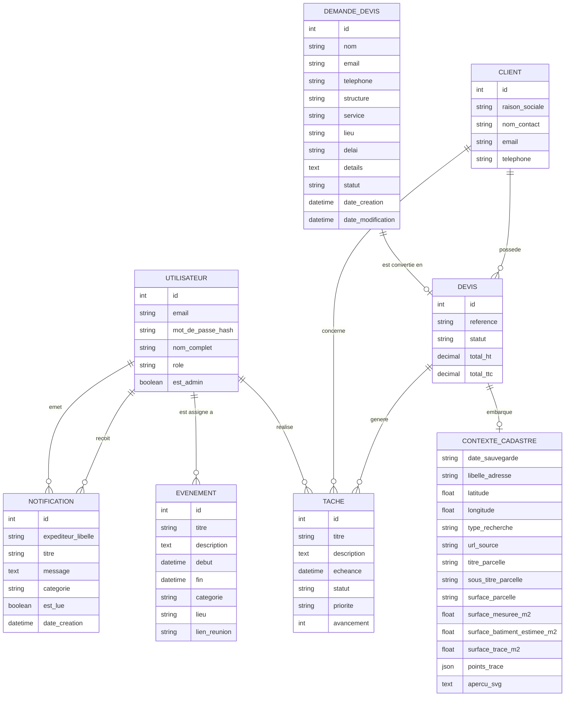

# Diagramme Merise - Cartotrac

Ce document décrit le modèle de données actuel de l'application complète : vitrine publique, intranet, clients, devis, cadastre, tableau de bord et administration.

## Périmètre

Le modèle persistant actuel couvre :

- les utilisateurs et leurs rôles ;
- les clients ;
- les demandes de devis publiques ;
- les devis ;
- le contexte cadastre associé à un devis, stocké en JSON ;
- les tâches du tableau de bord ;
- les événements du tableau de bord ;
- les notifications et messages internes.

## MCD



## Cardinalites Merise

| Association | Cardinalite | Regle |
| --- | --- | --- |
| DEMANDE_DEVIS - DEVIS | DEMANDE_DEVIS (0,1), DEVIS (0,1) | Une demande publique peut etre convertie en devis intranet. Un devis peut provenir d'une demande publique ou etre cree directement. |
| CLIENT - DEVIS | CLIENT (0,n), DEVIS (1,1) | Un client peut avoir aucun, un ou plusieurs devis. Un devis appartient obligatoirement a un seul client. |
| UTILISATEUR - TACHE | UTILISATEUR (0,n), TACHE (0,1) | Une tache peut etre assignee a un utilisateur, mais peut aussi rester non assignee. |
| CLIENT - TACHE | CLIENT (0,n), TACHE (0,1) | Une tache peut concerner un client, notamment pour une relance, un cadrage ou un suivi commercial. |
| DEVIS - TACHE | DEVIS (0,n), TACHE (0,1) | Une tache peut concerner un devis, par exemple une validation, une relance ou une mise a jour. |
| DEVIS - CONTEXTE_CADASTRE | DEVIS (0,1), CONTEXTE_CADASTRE (1,1) | Un devis peut embarquer un contexte cadastre. Le contexte cadastre n'existe pas seul dans la base actuelle, il est stocke dans `quotes.cadastre_context`. |
| UTILISATEUR - EVENEMENT | UTILISATEUR (0,n), EVENEMENT (0,1) | Un evenement peut etre assigne a un utilisateur, mais l'assignation est facultative. |
| UTILISATEUR - NOTIFICATION emise | UTILISATEUR (0,n), NOTIFICATION (0,1) | Une notification peut etre emise par un utilisateur identifie ou par un expediteur texte. |
| UTILISATEUR - NOTIFICATION recue | UTILISATEUR (0,n), NOTIFICATION (0,1) | Une notification peut cibler un utilisateur ou rester non attribuee a un compte precis. |

## MLD

```text
USERS(
  id PK,
  email UNIQUE NOT NULL,
  hashed_password NOT NULL,
  full_name NULL,
  role NOT NULL,
  is_admin NOT NULL
)

CLIENTS(
  id PK,
  company_name NOT NULL,
  contact_name NULL,
  email NULL,
  phone NULL
)

QUOTES(
  id PK,
  reference UNIQUE NOT NULL,
  client_id FK -> CLIENTS(id) NOT NULL,
  status NOT NULL,
  total_ht NOT NULL,
  total_ttc NOT NULL,
  cadastre_context JSON NULL
)

QUOTE_REQUESTS(
  id PK,
  name NOT NULL,
  email NOT NULL,
  phone NULL,
  company NULL,
  service NOT NULL,
  location NOT NULL,
  deadline NULL,
  details NOT NULL,
  status NOT NULL,
  converted_quote_id FK -> QUOTES(id) NULL,
  created_at NOT NULL,
  updated_at NOT NULL
)

DASHBOARD_TASKS(
  id PK,
  title NOT NULL,
  description NULL,
  due_at NOT NULL,
  status NOT NULL,
  priority NOT NULL,
  progress NOT NULL,
  assigned_user_id FK -> USERS(id) NULL,
  client_id FK -> CLIENTS(id) NULL,
  quote_id FK -> QUOTES(id) NULL
)

DASHBOARD_EVENTS(
  id PK,
  title NOT NULL,
  description NULL,
  starts_at NOT NULL,
  ends_at NULL,
  category NOT NULL,
  assigned_user_id FK -> USERS(id) NULL,
  location NULL,
  meeting_url NULL
)

DASHBOARD_NOTIFICATIONS(
  id PK,
  sender NOT NULL,
  sender_user_id FK -> USERS(id) NULL,
  recipient_user_id FK -> USERS(id) NULL,
  title NOT NULL,
  message NOT NULL,
  category NOT NULL,
  is_read NOT NULL,
  created_at NOT NULL
)
```

## Objets fonctionnels semi-structures

### Demande de devis publique

La page publique `/demande-devis` collecte :

- nom ;
- email ;
- telephone ;
- structure ;
- type de besoin ;
- lieu concerne ;
- delai souhaite ;
- description du besoin.

Elle cree maintenant une entree persistante dans `QUOTE_REQUESTS`. L'intranet peut consulter ces demandes et convertir une demande en client + devis brouillon. Le lien vers le devis converti est conserve via `converted_quote_id`.

### Cadastre

Le cadastre repose sur des appels externes et un brouillon local navigateur. Les donnees retenues peuvent ensuite etre stockees dans `QUOTES.cadastre_context`.

Le contexte cadastre contient notamment :

- adresse et point geographique ;
- type de recherche ;
- parcelle selectionnee ;
- surfaces estimees ou mesurees ;
- trace dessine ;
- apercu SVG.

## Regles de gestion principales

- Un utilisateur possede un role parmi `admin`, `manager`, `sales`, `viewer`.
- Les permissions applicatives sont derivees du role, pas stockees dans une table dediee.
- Un devis doit toujours etre lie a un client.
- Une demande de devis publique peut exister avant la creation d'un client.
- Une demande de devis convertie pointe vers le devis genere.
- La reference d'un devis est unique.
- Le statut d'un devis est une chaine libre cote base, avec `draft` comme valeur par defaut.
- Le contexte cadastre est optionnel et rattache au devis sous forme JSON.
- Une notification peut etre envoyee par un utilisateur, recue par un utilisateur, ou rester partiellement textuelle via `sender`.
- Un evenement peut etre assigne a un utilisateur, mais ce n'est pas obligatoire.
- Une tache peut etre globale, assignee a un utilisateur, rattachee a un client ou rattachee a un devis.

## Points d'amelioration du modele

- Ajouter des timestamps `created_at` et `updated_at` sur les entites principales.
- Normaliser les statuts de devis, taches et notifications via enums ou tables de reference.
- Sortir le contexte cadastre JSON vers des tables dediees si les recherches, parcelles ou traces doivent etre historises et requetes finement.
- Ajouter une table de pieces jointes pour documents, photos, plans, rapports et livrables.
