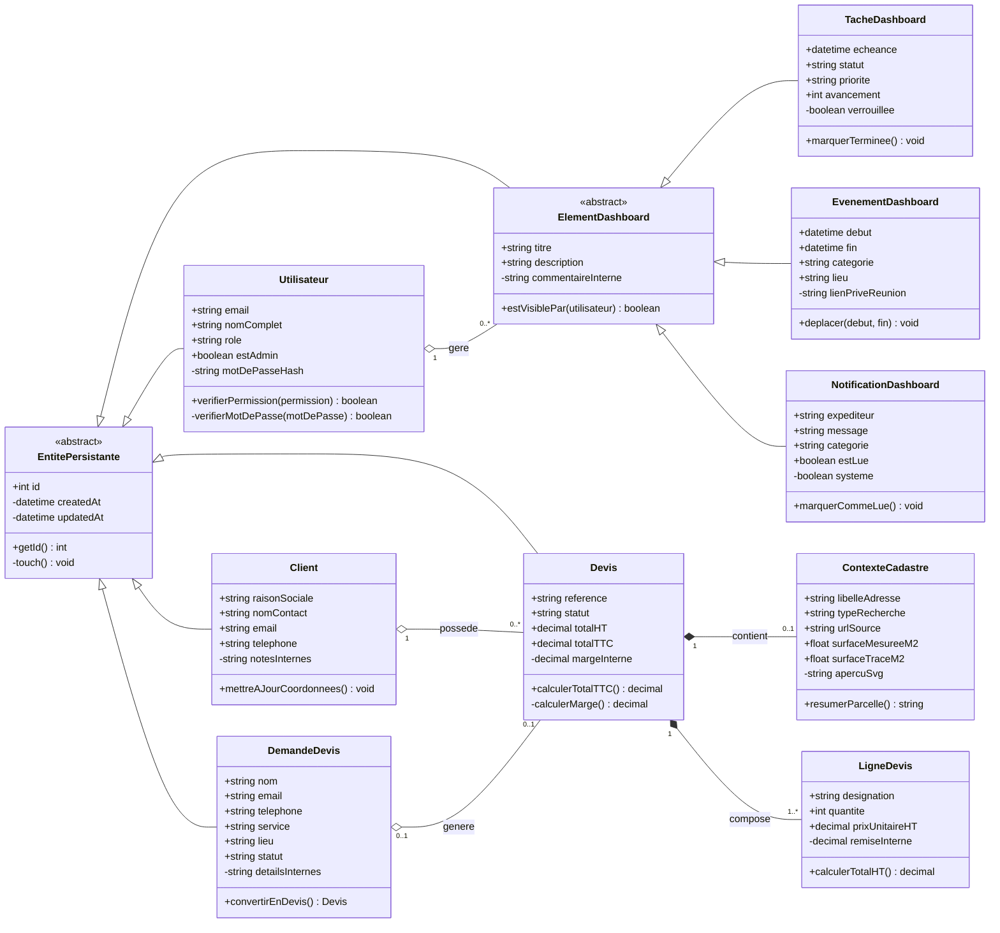

# Diagramme UML de classes - Cartotrac

Ce diagramme represente les principales classes metier de Cartotrac et leurs relations.

Il met en evidence :
- l'aggregation avec un losange vide `o--` ;
- la composition avec un losange plein `*--` ;
- l'heritage avec `<|--` ;
- les attributs publics `+` et prives `-`.

## Lecture du diagramme

| Concept UML | Exemple dans le diagramme | Sens |
| --- | --- | --- |
| Heritage | `ElementDashboard <|-- TacheDashboard` | Une tache, un evenement et une notification sont des specialisations d'un element de dashboard. |
| Aggregation | `Client o-- Devis` | Un client regroupe des devis, mais les classes gardent leur identite propre. |
| Composition | `Devis *-- ContexteCadastre` | Le contexte cadastre est embarque dans le devis et n'a pas de cycle de vie autonome dans l'application. |
| Attribut public | `+reference` | Attribut expose au reste de l'application. |
| Attribut prive | `-motDePasseHash` | Attribut interne qui ne doit pas etre manipule directement hors de la classe. |

