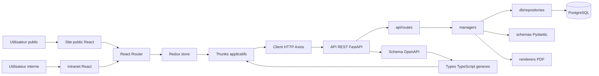

# Support de presentation - Cartotrac

Ce document sert de trame pour une presentation orale, un support de slides ou une soutenance technique.

## Nom du projet

Cartotrac.

## Description du projet

Cartotrac est une application web metier full-stack dediee a la gestion commerciale et cartographique.

Elle combine :
- un site public de presentation, contact et demande de devis ;
- un intranet securise pour les utilisateurs internes ;
- une gestion des clients, devis, demandes publiques, planning, taches et notifications ;
- un module cartographique/cadastral pour aider au cadrage d'un devis.

L'objectif est de centraliser un parcours souvent disperse entre emails, fichiers, outils cartographiques et documents commerciaux.

## Presentation de l'entreprise

Cartotrac est positionnee comme une entreprise de services autour de la cartographie, du cadastre, du releve terrain et des livrables techniques.

Le projet met en avant des activites comme :
- entretien toiture et facade ;
- cadastre et urbanisme ;
- releves photogrammetriques ;
- topographie et implantation ;
- cartographie, collecte et datavisualisation ;
- developpement SIG ;
- releves lidar et sonar ;
- production audiovisuelle et photographie aerienne.

L'application sert a la fois de vitrine commerciale et d'outil interne de suivi.

## Equipe

| Membre | Role | Missions principales |
| --- | --- | --- |
| Nathan Raynal | Developpeur full-stack / chef de projet technique | Cadrage, conception, developpement frontend/backend, modelisation BDD, securite, tests, documentation et preparation demo. |

Si le projet est presente comme un travail d'equipe, completer ce tableau avec les membres reels, leurs responsabilites et les fonctionnalites livrees par chacun.

## Stack technique

### Frontend

- React
- TypeScript
- Vite
- Material UI
- Redux Toolkit avec thunks classiques
- React Router
- Axios
- Zod
- Leaflet
- Sass / SCSS
- OpenAPI TypeScript pour les types d'API generes

### Backend

- Python 3.12
- FastAPI
- SQLAlchemy ORM
- Pydantic
- Alembic
- PostgreSQL
- JWT avec `python-jose`
- bcrypt pour le hash des mots de passe
- Pytest pour les tests automatises

### Base de donnees

- PostgreSQL
- Migrations Alembic
- Acces donnees via repositories SQLAlchemy

### Services externes et donnees

- API Adresse / geocodage pour la recherche d'adresse
- Donnees cadastrales exposees par les endpoints cartographiques
- Generation OpenAPI depuis le backend, puis generation des types frontend

## Diagramme de l'architecture de l'application

## Conception de la BDD

La conception de la base est documentee dans [docs/architecture/merise.md](../architecture/merise.md).

Le modele couvre notamment :
- utilisateurs et roles ;
- refresh tokens persistants ;
- clients ;
- demandes de devis publiques ;
- devis ;
- contexte cadastre embarque dans un devis ;
- taches du dashboard ;
- evenements du dashboard ;
- notifications et messages internes.

### Entites principales

| Table | Role |
| --- | --- |
| `users` | Comptes internes, roles et droits. |
| `refresh_token_sessions` | Sessions refresh token rotatives et revocables. |
| `clients` | Portefeuille client. |
| `quote_requests` | Demandes de devis publiques. |
| `quotes` | Devis internes rattaches a un client. |
| `dashboard_tasks` | Taches internes. |
| `dashboard_events` | Evenements du planning. |
| `dashboard_notifications` | Notifications et messages internes. |

Voir aussi :
- MCD et cardinalites : [merise.md](../architecture/merise.md)
- MLD : [merise.md](../architecture/merise.md)
- Migrations : `cartotrac-backend/alembic/versions`

## Diagrammes UML

Un diagramme UML de classes est disponible dans [docs/architecture/uml.md](../architecture/uml.md).

Il contient les notions attendues :
- heritage ;
- aggregation ;
- composition ;
- attributs publics ;
- attributs prives.

## Rapport des developpements

### Succes

- Mise en place d'une application full-stack exploitable.
- Separation claire entre frontend React et backend FastAPI.
- Backend organise en couches : routes, managers, schemas, repositories, models.
- Authentification reelle avec JWT, refresh tokens persistants et bcrypt.
- Controle d'acces par roles et permissions.
- CRUD clients, devis, utilisateurs, demandes de devis et contenus dashboard.
- Dashboard interne avec planning, messages, taches et notifications.
- Module carto/cadastre integre au parcours devis.
- Export PDF de devis.
- Types frontend generes depuis le contrat OpenAPI backend.
- Tests backend sur RBAC et injections SQL.
- Documentation architecture, MERISE, UML, RGPD, tests et CI/CD.

### Echecs ou difficultes

- Plusieurs refactorings d'architecture ont ete necessaires pour stabiliser les couches backend et frontend.
- La gestion Redux a d'abord ete trop dispersee, puis recentralisee autour de slices et thunks.
- La base locale a deja connu des decalages de migrations, par exemple la table `refresh_token_sessions` manquante.
- L'envoi d'email depuis la page contact reste un `mailto:` et non un vrai service SMTP.
- Le bundle frontend produit encore un warning Vite de taille de chunk.
- L'authentification utilise encore le `localStorage`, ce qui est acceptable en dev mais moins robuste qu'une strategie cookie `HttpOnly` en production.

### Que pouvez-vous ameliorer ?

- Ajouter un vrai service d'envoi d'email cote backend.
- Mettre en place des cookies `HttpOnly` pour durcir la session.
- Ajouter du code splitting frontend pour reduire le bundle initial.
- Etendre les tests frontend et les tests end-to-end.
- Ajouter une observabilite plus complete : logs structures, monitoring, erreurs applicatives.
- Ajouter une pagination et des filtres plus avances sur les listes.
- Ameliorer l'accessibilite avec un audit RGAA plus formel.
- Mettre en place un vrai design system partage.

### Qu'avez-vous appris ?

- Structurer un backend FastAPI en couches maintenables.
- Organiser un frontend React autour de routes, features, store Redux et thunks.
- Proteger une API avec JWT, refresh tokens et RBAC.
- Faire vivre un contrat OpenAPI entre backend et frontend.
- Concevoir une BDD relationnelle avec SQLAlchemy, PostgreSQL et Alembic.
- Documenter une application avec MERISE, UML et architecture applicative.
- Identifier l'importance des migrations dans la stabilite d'un environnement local.

### Prochaines etapes

- Finaliser un envoi de mail backend pour le formulaire de contact.
- Ajouter une gestion plus avancee des devis : statuts, relances, historique.
- Ajouter des tests end-to-end sur les parcours principaux.
- Optimiser le build frontend avec du lazy loading.
- Preparer une configuration de production plus securisee.
- Ajouter plus d'indicateurs metier dans le dashboard.
- Ameliorer l'experience mobile sur les ecrans intranet les plus denses.

## Resume / conclusion

Cartotrac est une V1 structuree d'application web metier.

Le projet demontre :
- une architecture full-stack separee ;
- une base de donnees relationnelle modelisee ;
- des routes API securisees ;
- une interface publique et un intranet ;
- une logique metier autour des clients, devis, cadastre et dashboard ;
- une documentation technique exploitable.

Le projet est deja coherent pour une demonstration, tout en gardant des axes realistes d'amelioration pour une mise en production plus robuste.

## Scenario de live demo

### Objectif de la demo

Montrer le parcours complet : un prospect exprime un besoin, puis un utilisateur interne traite l'information dans l'intranet.

### Scenario propose

1. Ouvrir la page d'accueil publique.
2. Presenter rapidement l'offre et les services.
3. Aller sur la page contact et montrer le formulaire de contact.
4. Aller sur la page demande de devis.
5. Remplir une demande avec un lieu, un service et une description.
6. Se connecter a l'intranet avec le compte admin.
7. Afficher le dashboard.
8. Naviguer dans le calendrier et creer un evenement sur le mois suivant avec un double clic.
9. Aller dans les clients et montrer la recherche / consultation.
10. Aller dans les devis et ouvrir un devis.
11. Montrer le module cadastre et le rattachement possible au contexte de devis.
12. Montrer l'administration des utilisateurs et les roles.

### Compte de demo

Compte local de developpement :
- email : `admin@cartotrac.com`
- mot de passe : `demo123`

### Points a commenter pendant la demo

- Separation site public / intranet.
- Authentification et permissions.
- Appels backend via thunks Redux.
- Types API generes par OpenAPI.
- Persistance PostgreSQL.
- Modelisation MERISE et UML.

## Annexe - Extraits de code a preparer

Ces extraits sont pertinents pour une discussion technique.

### Authentification backend

Fichiers :
- `cartotrac-backend/src/managers/auth.py`
- `cartotrac-backend/src/core/security.py`
- `cartotrac-backend/src/api/dependencies/auth.py`

Points a expliquer :
- verification bcrypt du mot de passe ;
- creation access token JWT ;
- creation refresh token opaque ;
- stockage du hash du refresh token ;
- rotation et revocation du refresh token.

### RBAC et permissions

Fichiers :
- `cartotrac-backend/src/core/permissions.py`
- `cartotrac-backend/src/api/dependencies/auth.py`
- `cartotrac-backend/src/api/routes/users.py`

Points a expliquer :
- roles `admin`, `manager`, `sales`, `viewer` ;
- permissions par domaine ;
- dependance FastAPI `require_permission(...)`.

### Architecture backend en couches

Exemple domaine clients :
- `cartotrac-backend/src/api/routes/clients.py`
- `cartotrac-backend/src/managers/clients.py`
- `cartotrac-backend/src/db/repositories/clients.py`
- `cartotrac-backend/src/db/models/clients.py`
- `cartotrac-backend/src/schemas/clients.py`

Points a expliquer :
- route HTTP ;
- logique applicative ;
- acces SQLAlchemy ;
- schema Pydantic ;
- model SQLAlchemy.

### Thunks frontend

Fichiers :
- `cartotrac-frontend/src/app/store/thunks/authThunks.ts`
- `cartotrac-frontend/src/app/store/thunks/dashboardThunks.ts`
- `cartotrac-frontend/src/app/store/thunks/clientsThunks.ts`
- `cartotrac-frontend/src/app/store/thunks/quotesThunks.ts`

Points a expliquer :
- appel backend centralise dans les thunks ;
- dispatch d'actions Redux ;
- separation entre etat global et etat local de formulaire.

### Generation OpenAPI

Fichiers :
- `cartotrac-backend/scripts/export_openapi.py`
- `cartotrac-frontend/src/shared/api/generated/schema.ts`
- `cartotrac-frontend/src/shared/api/routes.ts`
- `cartotrac-frontend/package.json`

Points a expliquer :
- export du schema OpenAPI depuis FastAPI ;
- generation TypeScript avec `openapi-typescript` ;
- usage de `components["schemas"]` dans les types frontend.

### Module calendrier

Fichier :
- `cartotrac-frontend/src/features/dashboard/pages/DashboardPage.tsx`

Points a expliquer :
- mois affiche independant du mois courant ;
- simple clic pour afficher les evenements ;
- double clic pour creer un evenement ;
- creation via thunk `createDashboardCalendarEvent`.

### Tests securite et RBAC

Fichiers :
- `cartotrac-backend/src/tests/test_rbac_api.py`
- `cartotrac-backend/src/tests/test_sql_injection_api.py`

Points a expliquer :
- verification des permissions par role ;
- refus des tentatives d'injection SQL ;
- tests API avec client FastAPI.

